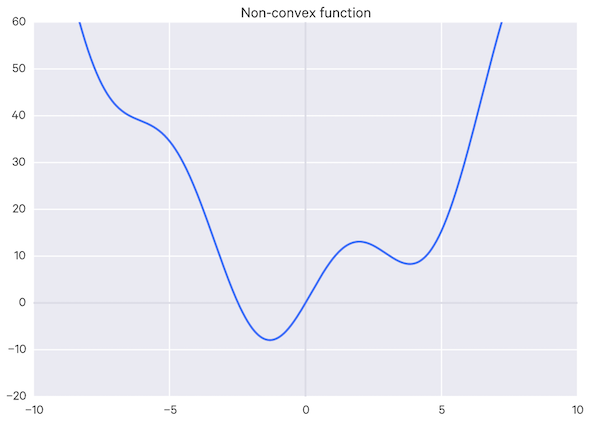

# Redes Neuronales

Lo que intentamos hacer con deep learning es imitar al cerebro, en especial en como aprende.

Empecemos por las neuronas, en si solas son inutiles pero cuando se tienen muchas intractuan para algo mayor, una synapse es una conexion de neurona a neurona.

### neuron = node

Una neurona en una computadora, es simplemente algo que recibe unos valores de entrada X (siempre tiene que estar estandarizado), y uno de salida Y (numerico, binario o categorico).

Antes de que X llegue a la neurona, va pasar por W (Weights o peso) esto es lo que se ajusta en la red neuronal.
 
La neurona solo recibe y suma los valores X multiplicados por W, y despues usa una funcion de activacion.

## Funcion de activacion

La funcion de activacion practicamente nos devuelve un cero o un uno, tenemos 4 funciones de activacio principales.

### Threshold Function: 
Si el valor es menor o igual a 0 retorna 0, y si el valor es mayor a 0 retorna 1.

### Sigmoid Function: 
Si el valor es menor a 0.5 retorna 0, de lo contrario retorna 1.

### Rectifier Function: 
Si el valor es menor a 0 retorn 0, pero si el valor es mayor regresa ese valor.

### Hyperbolic Tangent Function: 
Sirve como la sigmoid function solo que esta si puede retornar valores negativos.

## Como sirve una Red Neuronal

Como ejemplo vamos a usar un modelo ya entrenado para saber que precio va tener una casa dependiendo de las caracteristicas.

Tenemos input layer el cual tiene las caracteristicas de la casa que le vamos a pasar y tenemos el ouput layer que nos va decir el posible precio el resultado es equivalente a:

```
 Y = (x1 * w1) + (x2 * w2) + (x3 * w3) + (x4 * w4)
```

Esta representacion es sin ninguna hidden layer.

Las hidden layer es donde sucede la magia en la red neuronal, es donde se buscan los patrones en el dataset para hacer relaciones y cada neurona le da mas importancia a unos parametros que a otros, cada neurona se crea una configuracion diferente.

## Como aprende una Red Neuronal

Antes que nada dejamos claro que Y-hat y Y son diferentes variables Y-hat (ŷ) es el resultado obtenido por la red y Y es el resultado correcto. Esto nos servira para calcular el error entre cada vez que salgas un resultado.

Se usa la formula de costo que nos indica que tan mal esta nuestro red neuronal o modelo.

```
C = 1/2 * ( ( ŷ - y ) ^ 2 )
```

Nuestro objetivo es minimizar el costo ya que mientras mas pequeño sea el valor del costo, menos diferencia va haber entre ŷ - y.

Esta informacion va a los weights para que se actualizen, y este es el ciclo por el que pasamos para entrenar una red neuronal. Practicamente de los unico que tenemos control son los weights.

### Hasta ahora ha sido con una fila, osea solo un ejemplo del dataset, teniendo solo una neurona

Cuando tenemos mas de un ejemplo como, las calificaciones de 50 alumnos tenemos que pasar cada una de las calificaciones a la red neuronal, pasamos a la nuevo funcion de costo y luego se cambian los valores de weights.

```
C = ∑ 1/2 * ( ( ŷ - y ) ^ 2 )
```

Cada vez que se actualizan los weights se le dice backpropagation.

Una epoca (epoch) es una vuelta que hace la red neuronal sobre todo el dataset.

## Gradient Descent

Para saber de que manera vamos ajustar los weights, en otras palabras minimizar el costo, una de las maneras es usando brute-force, vamos a usar 1000 weights diferentes y los graficamos vamos a obtener una parabola por la formula, (f(x)=x^2), y el valor de x mientras mas cerca esta f(x) de 0 ese valor usamos.

Pero mientras mas weights usamos tenemos la maldicion de dimensionalidad.

Si por ejemplo tenemos una red neuronal de 1 layer de 5 neuronas y 5 entradas, vamos a tener 25 weights posibles entre cada weight y neurona, y por cada weight vamos a probar 1000 valores, eso significa que tenemos que porbar 10^75 de combinaciones.

La computadora mas rapida del mundo terminaria en 3.41x10^50 años en calcular todo eso.

Para eso tenemos el metodo gradient descent, una vez que tenemos nuestra funcion de costo graficada, graficamos un punto aleatorio, si sacamos la derivada parcial de ese momento de la funcion nos va decir a que lado tenemos que ir si es + se incrementa y si es - se decrementa el valor de x, cuando empieze a subir el valor de f(x) dejamos de incremetnar/decrementar.

## Stochastic Gradient Descent

Cuando usamos gradient descent solo nos serviria en complex functions, como una parabola perfecta, que pasa si nuestra funcion de costo graficada se ve asi:



Esta clase de graficas puede confundir a nuestro algoritmo de donde esta el mejor valor para usar, por que vemos como hay dos valores que en ambos lados esta rodeados.

Lo que pasa normalmente es con Gradient Descent es que ajusta los weights de nuestra red neuronal una vez que ya paso todo el dataset, pero en Stochastic Gradient Descent prueba un valr cambia los valores de los weights prueba otro vuelve a cambiar y asi con todos hata probar todo el dataset.

El gradient descent normal tambien es llamado Batch Gradient Descent.

## Backpropagation

Ya entendemos lo que pasa en Forward Propagation que simplemente pasar los inputs por los layers y generar un resultado Yhat para despues suceda Back Propagation el cual actualiza los weights. 

Back Propagations es una algoritmo que actualiza los weights al mismo tiempo. Es algo que no podemos hacer manualmente.

### Y en resumen en esto consiste entrenar una red neuronal:


1. Asignar valores aleatorios a los weights cerca del 0.
2. Pasar la primera fila de valores al input layer, cada feature es un node.
3. Forward Propagation, viaja la informacion de izquierda a derecha para activar las neuronas de cierta manera limitandose por el valor de weights hasta conseguir el output.
4. Comparamos la prediccion con el valor deseado, con la funcion de costo.
5. Back Propagation, viaja la informacion de derecha a izquierda, actualizando las weights de acuerdo que tan responsables son del erro, el learning rate decide que tanto les actualizamos.
6. Repetimos del 1 al 5 y actualizamos los weights despues de cada observacion (Reinforcement Learning).
6. Repetimos del 1 al 5 y actualizamos los weights despues de muchas observaciones (Batch Learning).
7. Cuando todo el training set pasa una vez por la red neuronal eso crea una epoca (epoch), corremos mas epocas.
