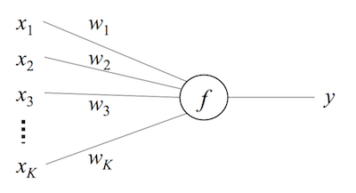
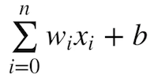
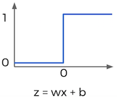
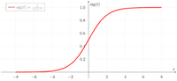
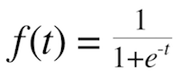
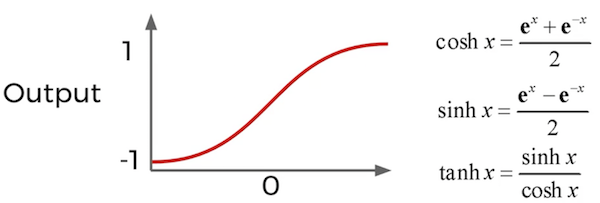
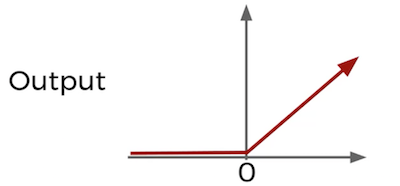
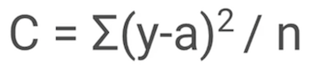
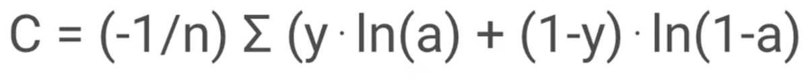

# Teoria de Redes Neuronales

Las redes neuronales estan basadas de como sirve nuestro cerebro. Es una represetnacion matematica que se puede usar en computadoras para simular el aprendizaje.

## Neuronas

Intentamos imitar la manera en que se comportan las neuronas, obteniedo datos de entrada, multiplicarlos por algunos pesos (weights), luego se pasa la suma de todo por una funcion de activacion, de las cuales hay muchas pero por poner un ejemplo nuestra funcion de activacion retorna 1 cuando el valor es positivo y retorna 0 cuando el valor sea negativo.

Pero pasaria un error si definamos las entradas aleatoriamente ya que puede haber un 0 y no importa el valor de los pesos la multiplicacion va dar cero y la funcion de activacion no sabra que hacer, por eso agregamos el bias que solo es un valor de entrada mas que no se multiplica por los pesos.
 



## Funciones de activacion

La funcion de activacion que definimos previamente era si un valor es positivo devuelva 1 y si es negativo devuelva 0, se veria algo asi



Esta es una funcion muy dramatica ya que si llega haber algun pequeño cambio no se va notar, e incluso valores muy drasticos.

Por eso tenemos otro tipo de funciones de activacion, por ejemplo esta la funcion sigmoidal (sigmoid function) la cual si no deja notar cambios en los datos.




Tenemos mas funciones de activacion como

### Hyporboliyc Tanget



### Relu

```
if valor <= 0: 
	return 0
else:
	return valor
```



## Funcion de costo

La funcion de costo sirve para evaluar el redimiento de la neurona, en otras palabras que tan lejos esta del valor real. Para poder medir esto tenemos las siguientes formulas.

### Cuadritc

Los errores se hacen al cuadrado para que las diferencias entre resultado deseado y el predicciones se hagan notar mas. Esta puede que haga el proceso de aprendizaje sea mas lento por eso usaremos otra formula



### Crossentropy

Mientras mas sea la diferencia entre prediccion y respuesta real (y - a) las neuronas aprendan mas rapido 



## Gradient Descent y Backpropagation

Gradient descent es un algoritmo de optimizacion que en esencia busca el valor minimo de salida de un funcion, en este caso seria el de la funcion de costo.


Backpropagation es una tecnica que sirve con gradient descent ya que buscando los valores minimos de la funcion de costo va ajustar los valores de los pesos este algoritmo.